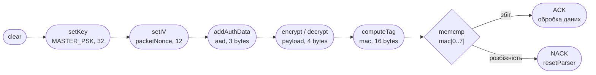
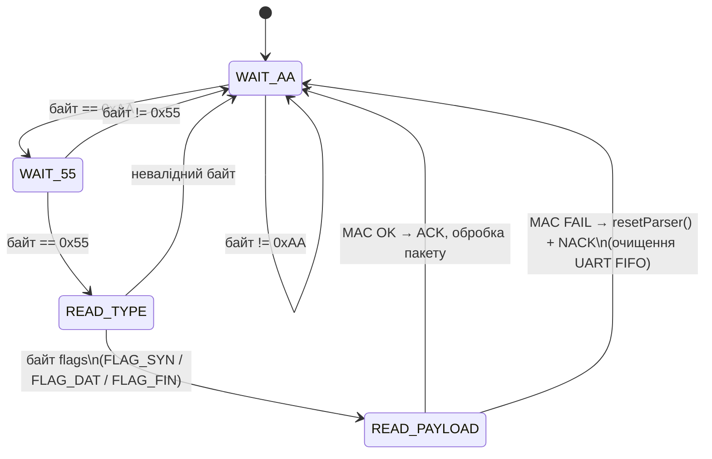
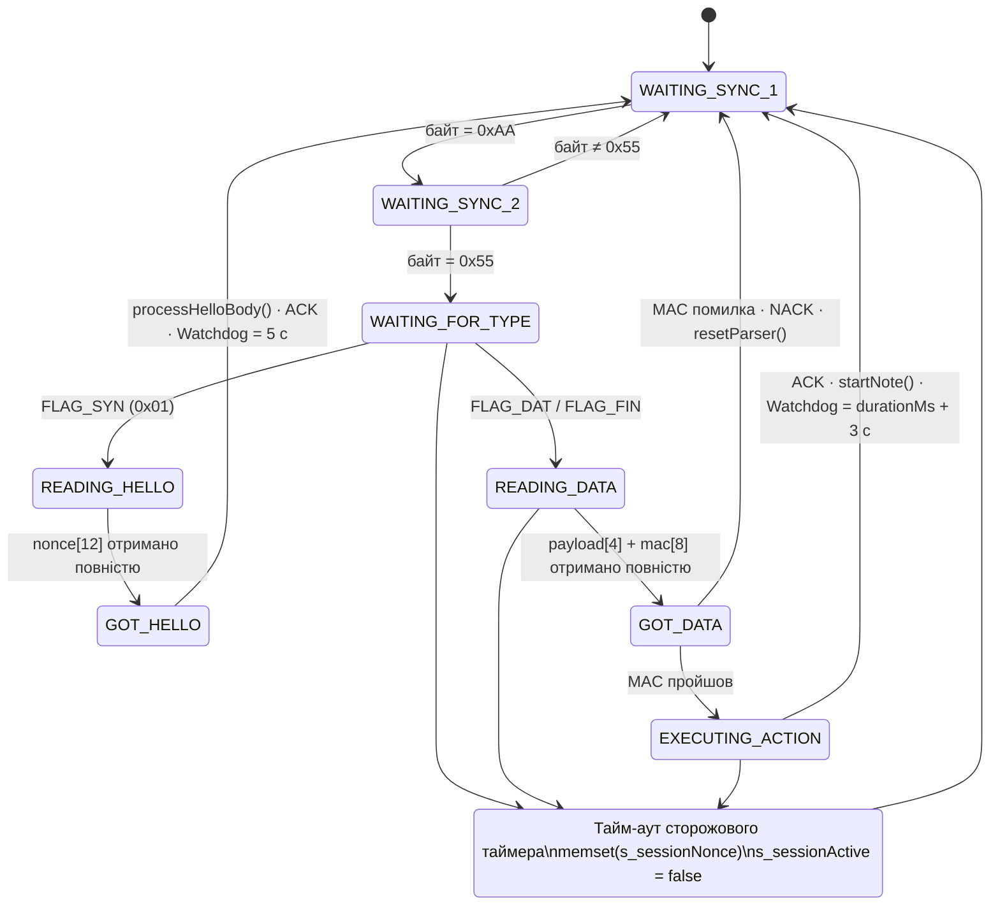

# SH2SC-EDT

[en English](README.md) | [uk Українська](README_uk.md)

**Самовідновлюваний апаратно-програмний комплекс для зашифрованої передачі даних**

---

## Анотація

SH2SC-EDT — це відмовостійкий, криптографічно захищений комплекс передачі даних, побудований
на двох мікроконтролерах Arduino Nano (ATmega328P). Він реалізує спеціалізований протокол
транспортного/сесійного рівня — **C2P-ARQ (ChaCha20-Poly1305 Automatic Repeat reQuest)** —
який забезпечує автентифіковане шифрування (ChaCha20-Poly1305 AEAD), гарантовану доставку
пакетів через ARQ «Зупинись і чекай» і повний трифазний цикл сесії (SYN / DAT / FIN).

Визначальна властивість комплексу — **самовідновлення**: при розриві зв'язку вузол-передавач
зберігає свою позицію в потоці даних і автономно відновлює сесію з точної точки збою без
втручання оператора і без втрати даних. Вся логіка на обох вузлах реалізована у вигляді
неблокуючих кінцевих автоматів, що працюють на 100% у реальному часі в SimulIDE. Динамічне
виділення пам'яті архітектурно заборонено; вся прошивка функціонує в межах бюджету 2 КБ SRAM
мікроконтролера ATmega328P.

---

## Основні можливості

- **Автентифіковане шифрування (AEAD):** потоковий шифр ChaCha20 зі скороченим 8-байтним
  MAC Poly1305 на кожний пакет. Жоден пакет не обробляється до успішної MAC-верифікації
  через `memcmp`.
- **Повний цикл сесії:** трифазна сесія C2P-ARQ — рукостискання `FLAG_SYN` (доставка nonce),
  передача даних `FLAG_DAT` (ARQ «Зупинись і чекай»), завершення `FLAG_FIN` (автентифіковане
  закриття сесії).
- **Виведення nonce для пакету:** унікальний вектор ініціалізації (IV) для кожного пакету
  визначається локально з сесійного nonce через XOR з 16-бітним порядковим номером по байтах
  `[10..11]`. IV ніколи не передається по каналу.
- **ARQ «Зупинись і чекай»:** кожен `DataPacket` вимагає явного `ACK_BYTE` (`0x06`). При
  `NACK_BYTE` (`0x15`) або тайм-ауті передавач повторно надсилає ідентичний шифротекст із тим
  самим `seqNum`. Ліміт спроб: `MAX_RETRIES = 50`, вікно тайм-ауту: `ACK_TIMEOUT_MS = 50 мс`.
- **Самовідновлення (Auto-Resume):** при вичерпанні спроб `suspendSession()` стирає сесійний
  nonce з RAM, зберігає `melodyIndex` і переходить у `TxState::RECONNECTING`. Новий
  `HelloPacket` транслюється кожні `RECONNECT_INTERVAL_MS = 2000 мс` до відновлення зв'язку.
  Передача відновлюється зі збереженого індексу без втрати жодного пакету.
- **Динамічний розумний сторожовий таймер (RX):** тайм-аут сесії приймача адаптується після
  кожного автентифікованого пакету: `current_timeout_limit = durationMs + NETWORK_GRACE_PERIOD_MS`
  (3000 мс). Поглинає найгіршу бурю повторних передач (`50 × 50 мс = 2500 мс`) без
  помилкового завершення сесії.
- **Архітектура «Кінцевий автомат — насамперед»:** вся логіка TX та RX керується виключно
  кінцевими автоматами на основі `enum class`. Жодних блокуючих викликів `delay()` у
  головному циклі. Всі таймери використовують дельти `millis()`.
- **Апаратний ГПВП:** сесійний nonce генерується ГПВП на основі ChaCha20, засіяним 256 бітами
  апаратної ентропії (кільцевий осцилятор, неініціалізована SRAM, вбудований АЦП, TCNT1,
  АЦП білого шуму).

---

## Специфікація протоколу: C2P-ARQ

### Формат кадру

Перед кожним кадром іде двобайтова преамбула синхронізації (`0xAA 0x55`). Байт `flags`
використовує бітову маску (`&`), що забезпечує стійкість до одиничних бітових помилок.

#### HelloPacket — 15 байт на дроті

| Поле        | Розмір    | Значення          | Опис                                         |
|-------------|-----------|-------------------|----------------------------------------------|
| SYNC1       | 1 байт    | `0xAA`            | Байт преамбули 1                             |
| SYNC2       | 1 байт    | `0x55`            | Байт преамбули 2                             |
| `flags`     | 1 байт    | `FLAG_SYN = 0x01` | Ідентифікатор відкриття сесії                |
| `nonce[12]` | 12 байт   | ГПВП              | 96-бітний сесійний nonce ChaCha20 IETF       |

#### DataPacket (FLAG_DAT / FLAG_FIN) — 17 байт на дроті

| Поле          | Розмір  | Значення           | Опис                                                        |
|---------------|---------|--------------------|-------------------------------------------------------------|
| SYNC1         | 1 байт  | `0xAA`             | Байт преамбули 1                                            |
| SYNC2         | 1 байт  | `0x55`             | Байт преамбули 2                                            |
| `flags`       | 1 байт  | `0x02` / `0x04`    | `FLAG_DAT` або `FLAG_FIN` — **AAD, не шифрується**          |
| `seq_num`     | 2 байти | `uint16_t` LE      | Порядковий номер пакету — **AAD, не шифрується**            |
| `payload[4]`  | 4 байти | Шифротекст ChaCha20 | Зашифровані `uint16_t note_index` + `uint16_t duration_ms` |
| `mac[8]`      | 8 байт  | Скорочений Poly1305 | Перші 8 байт повного 16-байтного тегу Poly1305             |

3-байтні AAD (`flags` + `seq_lo` + `seq_hi`) автентифікуються, але не шифруються. Будь-яка
зміна цих полів призводить до відмови MAC-верифікації.

Для пакетів `FLAG_FIN` корисне навантаження — зашифровані нулі. Конвеєр RX **зобов'язаний**
викликати `decrypt()` у `discardBuf` перед `computeTag()` для правильного просування
акумулятора Poly1305; пропуск `decrypt()` дає хибний очікуваний тег і призводить до
помилкового NACK.

### Параметри ARQ

| Константа                 | Значення | Опис                                                          |
|---------------------------|----------|---------------------------------------------------------------|
| `ACK_TIMEOUT_MS`          | 50 мс    | Максимальний час очікування ACK до повторної передачі         |
| `MAX_RETRIES`             | 50       | Послідовних повторних передач до `suspendSession()`           |
| `RECONNECT_INTERVAL_MS`   | 2000 мс  | Інтервал трансляції HelloPacket у стані `RECONNECTING`        |
| `NETWORK_GRACE_PERIOD_MS` | 3000 мс  | Додається до тривалості ноти для тайм-ауту сторожового таймера |
| `BAUD_RATE`               | 9600     | Швидкість UART (8N1)                                          |

### Очищення FIFO (запобігання «отруєнню» буфером)

`drainRxFifo()` викликається на TX перед кожним `sendHelloPacket()`, `sendPacket()` та
`sendFinPacket()`. Функція скидає всі байти в 64-байтному апаратному RX FIFO UART, запобігаючи
потраплянню застарілих NACK від попереднього пакету до обробника наступного.

На RX функція `resetParser()` виконує симетричну операцію після кожного MAC-збою або тайм-ауту
парсера: скидає FIFO та переводить байтовий кінцевий автомат у стан `WAIT_AA`.

---

## Модель безпеки

### Конвеєр автентифікованого шифрування

Обидва вузли використовують бібліотеку [`ChaChaPoly`](https://github.com/rweather/arduinolibs)
(Rhys Weatherley, Arduino Crypto). Конвеєр на TX та RX ідентичний:



Передаються лише перші 8 байт з 16-байтного тегу Poly1305 (`TRUNCATED_MAC_SIZE = 8`).

### Стійкість до атак повторного відтворення

IV для пакету виводиться без передачі по каналу:

```cpp
uint8_t packetNonce[12];
memcpy(packetNonce, s_sessionNonce, 12);
packetNonce[10] ^= (uint8_t)((seqNum >> 8u) & 0xFF);
packetNonce[11] ^= (uint8_t)(seqNum         & 0xFF);
```

Всі 65 536 значень `seqNum` дають унікальний IV у межах сесії. Новий `s_sessionNonce`
генерується ГПВП при кожному натисканні кнопки або спробі `RECONNECTING`, що унеможливлює
міжсесійні атаки повторного відтворення.

### Безпечне знищення ключового матеріалу

`MASTER_PSK` скомпільовано в обидва вузли і ніколи не передається. `s_sessionNonce` — єдиний
секрет часу виконання — стирається при кожній межі сесії:

```cpp
memset(s_sessionNonce, 0x00, HELLO_NONCE_SIZE); // HELLO_NONCE_SIZE = 12
```

Виклик виконується безумовно у чотирьох місцях:

| Місце                              | Подія-тригер                                       |
|------------------------------------|----------------------------------------------------|
| TX `suspendSession()`              | Вичерпано `MAX_RETRIES` у будь-якому стані `WAITING_*` |
| TX успіх `WAITING_FIN_ACK`         | `FLAG_FIN` підтверджено RX                         |
| RX `processFinPacket()` MAC OK     | Автентифіковане закриття сесії                     |
| Тайм-аут сторожового таймера RX    | TX зник без надсилання `FLAG_FIN`                  |

Ключовий матеріал **ніколи** не виводиться до `Serial`, LCD або будь-якого іншого каналу.

---

## Довідник станів кінцевих автоматів

### Передавач — `TxState` (9 станів)

```mermaid
stateDiagram-v2
    [*] --> IDLE

    IDLE --> SENDING_HELLO : натискання кнопки

    SENDING_HELLO --> WAITING_HELLO_ACK : HelloPacket надіслано

    WAITING_HELLO_ACK --> SENDING : ACK отримано
    WAITING_HELLO_ACK --> RECONNECTING : NACK / тайм-аут × MAX_RETRIES\nsuspendSession()

    SENDING --> WAITING_ACK : DataPacket надіслано

    WAITING_ACK --> WAIT_BETWEEN_NOTES : ACK отримано
    WAITING_ACK --> RECONNECTING : NACK / тайм-аут × MAX_RETRIES\nsuspendSession()

    RECONNECTING --> SENDING_HELLO : ACK на HelloPacket\n(авто-пінг кожні 2 с)

    WAIT_BETWEEN_NOTES --> SENDING : пауза минула, ноти залишились
    WAIT_BETWEEN_NOTES --> SENDING_FIN : всі ноти надіслано

    SENDING_FIN --> WAITING_FIN_ACK : FinPacket надіслано

    WAITING_FIN_ACK --> IDLE : ACK отримано\nmemset(s_sessionNonce)
    WAITING_FIN_ACK --> RECONNECTING : NACK / тайм-аут × MAX_RETRIES\nsuspendSession()
```



### Приймач — байтовий `ParseState`



### Відображення/сторожовий таймер приймача — `RxState`



---

## Апаратне забезпечення та середовище

### Цільове обладнання

| Компонент          | Специфікація                                                      |
|--------------------|-------------------------------------------------------------------|
| Мікроконтролери    | 2× Arduino Nano (ATmega328P, 16 МГц, 2 КБ SRAM, 32 КБ Flash)    |
| Дисплеї            | 2× Aip31068 I2C LCD 16×2, адреса `0x3E`, виводи A4/A5            |
| Зумер              | 1× П'єзодинамік на ШІМ-виводі 9 (лише вузол B)                   |
| Джерело ентропії   | Апаратний кільцевий осцилятор на INT0 (вивід 2, обидва вузли)    |
| Генератор шуму     | XOR-вентиль + Генератор імпульсів (1 кГц, 15%) + AND + Перемикач |
| Моніторинг         | Багатоканальний осцилограф, Час/Поділ ≈200 мкс                   |

### Необхідні бібліотеки

| Бібліотека                         | Призначення                              | Джерело              |
|------------------------------------|------------------------------------------|----------------------|
| `Arduino Cryptography Library` (Crypto) | ChaCha20-Poly1305 AEAD              | [Rhys Weatherley](https://github.com/rweather/arduinolibs) |
| `LiquidCrystal_AIP31068`           | I2C LCD-драйвер для контролера Aip31068  | [Andriy Golovnya](https://github.com/red-scorp/LiquidCrystal_AIP31068) |

### Середовище збирання

- **Arduino IDE** 2.x з пакетом підтримки плат AVR.
- **SimulIDE** 1.1.0 (або новіший) для симуляції схем і валідації в реальному часі.
- Компілятор: `avr-g++` зі стандартом C++11 (`-std=gnu++11`).

---

## Структура репозиторію

```
sh2sc-edt/
|
+-- TransmitterNode/
|   +-- TransmitterNode.ino   Точка входу: setup(), loop(), демпфування кнопки
|   +-- transmitter.h         КА TxState, sendHelloPacket(), sendPacket(),
|   |                         sendFinPacket(), suspendSession(), drainRxFifo()
|   +-- protocol.h            Спільні структури (HelloPacket, DataPacket), константи
|   |                         прапорів, MASTER_PSK, часові константи
|   +-- csprng.h              ГПВП на основі ChaCha20, пул апаратної ентропії,
|   |                         кеш потоку ключів 64 байти
|   +-- melody.h              Масиви мелодії PROGMEM (індекси нот, тривалості)
|
+-- ReceiverNode/
|   +-- ReceiverNode.ino      Точка входу: setup(), loop(), таймер ноти, watchdog
|   +-- receiver.h            КА RxState, processReceivedByte(), ParseState,
|   |                         authenticateAndPlay(), processFinPacket(),
|   |                         resetParser(), динамічний сторожовий таймер
|   +-- protocol.h            Спільні структури та константи (ідентичні TX)
|   +-- csprng.h              ГПВП (варіант RX, без джерела ентропії від кнопки)
|
+-- docs/
|   +-- main.qd               Джерело технічної документації Quarkdown
|
+-- shsc-arq.sim1             Файл схеми SimulIDE (основна симуляція)
+-- README.md                 Документація англійською
+-- README_uk.md              Документація українською (цей файл)
```

---

## Довідник ключових констант

| Константа               | Значення | Визначено в    | Опис                                         |
|-------------------------|----------|----------------|----------------------------------------------|
| `FLAG_SYN`              | `0x01`   | `protocol.h`   | Прапор кадру відкриття сесії                 |
| `FLAG_DAT`              | `0x02`   | `protocol.h`   | Прапор кадру даних                           |
| `FLAG_FIN`              | `0x04`   | `protocol.h`   | Прапор кадру закриття сесії                  |
| `ACK_BYTE`              | `0x06`   | `protocol.h`   | Позитивне підтвердження                      |
| `NACK_BYTE`             | `0x15`   | `protocol.h`   | Негативне підтвердження                      |
| `SYNC_BYTE_1`           | `0xAA`   | `protocol.h`   | Байт преамбули 1                             |
| `SYNC_BYTE_2`           | `0x55`   | `protocol.h`   | Байт преамбули 2                             |
| `HELLO_NONCE_SIZE`      | `12`     | `protocol.h`   | Довжина nonce ChaCha20 IETF (байти)          |
| `TRUNCATED_MAC_SIZE`    | `8`      | `protocol.h`   | Довжина переданого тегу Poly1305             |
| `DATA_PAYLOAD_SIZE`     | `4`      | `protocol.h`   | Довжина зашифрованого корисного навантаження |
| `REST_INDEX`            | `255`    | `protocol.h`   | Сторожовий індекс для тиші/паузи             |
| `NOTE_DICT_SIZE`        | `21`     | `receiver.h`   | Розмір таблиці частот                        |
| `MAX_RETRIES`           | `50`     | `protocol.h`   | Ліміт повторних передач ARQ                  |
| `ACK_TIMEOUT_MS`        | `50`     | `protocol.h`   | Вікно очікування ACK (мс)                    |
| `RECONNECT_INTERVAL_MS` | `2000`   | `transmitter.h`| Інтервал трансляції HelloPacket              |
| `NETWORK_GRACE_PERIOD_MS` | `3000` | `receiver.h`  | Додатковий час сторожового таймера           |

---

## Академічний контекст

Розроблено як проєкт з дисципліни **«Архітектура комп'ютерних систем»**. Система демонструє,
що ресурсно-обмежений 8-бітний мікроконтролер AVR здатен реалізувати промислову криптографічну
автентифікацію (AEAD), протокол зі збереженням стану сесії та відновлення після збоїв на
рівні застосунку в межах бюджету SRAM 2 КБ. Генератор шуму SimulIDE (XOR-вентиль +
генератор імпульсів 1 кГц) забезпечує відтворювані пошкодження каналу для валідації всіх
п'яти сценаріїв відмовостійкості: одиничне пошкодження пакету, тривале глушіння (доказ
самовідновлення), отруєння буфера FIFO, спрацювання динамічного сторожового таймера та
пошкодження FLAG_FIN під шумом.
